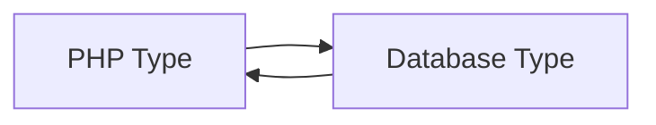

# Type casting values

Type casting is the process of converting a value from one data type to another. In the context of the database,
type casting is used to ensure that values are saved and retrieved in the correct type.



## Casting values to be saved in the database

When saving a value to the database, the value must be in the correct type. For example, if saving a value to a column
that is of type `bit`, the value must be an `integer` or `string` depends on DBMS.

By default `update()`, `insert()`, `insertBatch()`, `insertReturningPks()`, `upsert()`, `upsertReturning()` and
`upsertReturningPks()` methods of `CommandInterface` and `QueryBuilderInterface` instances cast the values 
to the correct type.

```php
use Yiisoft\Db\Connection\ConnectionInterface;

/** @var ConnectionInterface $db */
$command = $db->createCommand();
$command->insert('customer', [
    'name' => 'John Doe',
    'is_active' => true,
]);
$command->execute();
```

In the example above, the value of `is_active` is a `boolean`, but the column `is_active` can be of type `bit`.
The `CommandInterface::insert()` method by default cast the value to the correct type.

### Using `ColumnInterface::dbTypecast()`

To ensure that the value is saved in the correct type, `ColumnInterface::dbTypecast()` method can be used to cast 
the value.

```php
$isActive = true;
// Cast the value to the correct database type
$isActive = $db->getTableSchema('customer')->getColumn('is_active')->phpTypecast($isActive);

$command = $db->createCommand();
$command->setSql('INSERT INTO {{customer}} (name, is_active) VALUES (:name, :is_active)', [
    ':name' => 'John Doe',
    ':is_active' => $isActive,
]);
$command->execute();
```

In the example above, the value of `is_active` is casted to the correct database type before it is saved.

### Using `QueryBuilderInterface::withTypecasting()` or `CommandInterface::withDbTypecasting()`

You can also use `QueryBuilderInterface::withTypecasting()` or `CommandInterface::withDbTypecasting()` methods to
enable or disable type casting.

```php
$command = $db->createCommand()->withDbTypecasting(false);
$command->insert('customer', [
    'name' => 'John Doe',
    'is_active' => 1,
]);
$command->execute();
```

In the example above, the value of `is_active` is not casted to the correct type before it is saved. The value
is saved as an integer `1` instead of a `bit` or a `bool`. This is useful when you want to save the value as is or 
the value is already in the correct type.

## Casting values retrieved from the database

When you retrieve a value from the database, the value can be returned in a different type than you expect.
For example, a value that is stored as a `numeric(5,2)` in the database will be returned as a `string`. This is because 
the database driver does not convert some data types when retrieves values.

### Using `ColumnInterface::phpTypecast()`

To ensure that the value is returned in the correct type, you can use `ColumnInterface::phpTypecast()` method to cast 
the value, in the example above, to a `float`.

```php
$command = $db->createCommand('SELECT * FROM {{customer}} WHERE id = 1');

$row = $command->queryOne();
$isActive = $row['is_active'];

// Cast the value to the correct type
$isActive = $db->getTableSchema('customer')->getColumn('is_active')->phpTypecast($isActive);
```

In the example above, the value of `is_active` can be retrieved from the database as a `bit`, but the correct PHP type 
is `boolean`. The `ColumnInterface::phpTypecast()` method is used to cast the value to the correct type.

### Using `QueryInterface::withTypecasting()` or `CommandInterface::withPhpTypecasting()`

Optionally, you can use `QueryInterface::withTypecasting()` or `CommandInterface::withPhpTypecasting()` methods to cast
the values when retrieving them from the database. Using these methods, values are casted to the correct type before
they are returned.

```php
$query = $db->select()->from('customer')->where(['id' => 1]);

$row = $query->withTypecasting()->one();
$isActive = $row['is_active'];
```

```php
$command = $db->createCommand('SELECT * FROM {{customer}} WHERE id = 1');

$row = $command->withPhpTypecasting()->queryOne();
$isActive = $row['is_active'];
```

In the examples above, the value of `is_active` is casted to the correct `boolean` type before it is returned.

## DateTime, Date and Time types

Some databases support date and time types, such as `timestamp`, `datetime`, `date`, `time`, etc.
These types are casted to `DateTimeImmutable` objects using `DateTimeColumn` class when type casting is enabled.

```php
$query = $db->select()->from('customer')->where(['id' => 1]);

$row = $query->withTypecasting()->one();
$createdAt = $row['created_at']; // `DateTimeImmutable` object
```

```php
$command = $db->createCommand('SELECT * FROM {{customer}} WHERE id = 1');

$row = $command->withTypecasting()->queryOne();
$createdAt = $row['created_at']; // `DateTimeImmutable` object
```

In the examples above, the value of `created_at` column is casted to the `DateTimeImmutable` type before it is returned.

```php
$db->createCommand()->insert('customer', [
    'name' => 'John Doe',
    'updated_at' => new DateTimeImmutable(),
])->execute();
```

In the example above, the value of `updated_at` is casted to the correct database type before it is saved.

## Custom type casting

To implement custom type casting you need to extend the `AbstractColumn` class and override the `dbTypecast()` 
and `phpTypecast()` methods.

For example, in Postgres database, the `point` type is represented as a string in the format `(x,y)`. To cast the value
to a `Point` class, you can create a custom column class and override the `dbTypecast()` and `phpTypecast()`.

```php
use Yiisoft\Db\Expression\Expression;
use Yiisoft\Db\Expression\ExpressionInterface;
use Yiisoft\Db\Schema\Column\AbstractColumn;

final class PointColumn extends AbstractColumn
{
    /**
     * @var string The default column abstract type
     */
    protected const DEFAULT_TYPE = 'point';

    /**
    * @param ExpressionInterface|Point|string|null $value
    */
    public function dbTypecast(mixed $value): ExpressionInterface|string|null
    {
        if ($value instanceof Point) {
            return new Expression('(:x,:y)', ['x' => $value->getX(), 'y' => $value->getY()]);
        }
    
        return $value;
    }

    /**
    * @param string|null  $value
    */
    public function phpTypecast(mixed $value): Point|null
    {
        if (is_string($value)) {
            [$x, $y] = explode(',', substr($value, 1, -1));

            return new Point((float) $x, (float) $y);
        }
    
        return $value;
    }
}

class Point
{
    public function __construct(
        private float $x,
        private float $y,
    ) {
    }

    public function getX(): float
    {
        return $this->x;
    }

    public function getY(): float
    {
        return $this->y;
    }
}
```

Then use the custom column class in the database connection configuration.

```php
use Yiisoft\Db\Pgsql\Column\ColumnFactory;
use Yiisoft\Db\Pgsql\Connection;

$columnFactory = new ColumnFactory(
    'columnClassMap' => [
        // It is necessary to define the column class map for the custom abstract type
        // abstract type => class name
        'point' => PointColumn::class,
    ],
    'typeMap' => [
        // It is necessary to define the type map for the database type
        // database type => abstract type
        'point' => 'point',
    ],
);

// Create a database connection with the custom column factory
$db = new Connection($pdoDriver, $schemaCache, $columnFactory);
```

In the example above, the `PointColumn` class is used to cast the `point` database type to the `Point` class.
The `Point` class is used to represent the `point` type as an object with `x` and `y` properties.

> [!WARNING]
> If you use different custom type casting for different database connections, you need also use different schema 
> cache for such connections.

## Lazy type casting

Lazy type casting is a way to defer the type casting of a value until it is accessed. This can be useful when you want
to avoid the overhead of type casting for values that are not used.

Here is an example how to configure lazy type casting for the `array`, `json` and `structured` database types.

```php
use Yiisoft\Db\Constant\ColumnType;
use Yiisoft\Db\Pgsql\Column\ColumnFactory;
use Yiisoft\Db\Pgsql\Connection;
use Yiisoft\Db\Schema\Column\ArrayLazyColumn;
use Yiisoft\Db\Schema\Column\StructuredLazyColumn;
use Yiisoft\Db\Schema\Data\JsonLazyArray;

$columnFactory = new ColumnFactory(
    'columnClassMap' => [
        ColumnType::ARRAY => ArrayLazyColumn::class, // converts values to `LazyArray` objects 
        ColumnType::JSON => JsonLazyColumn::class, // converts values to `JsonLazyArray` objects
        ColumnType::STRUCTURED => StructuredLazyColumn::class, // converts values to `StructuredLazyArray` objects
    ],
);

// Create a database connection with the custom column factory
$db = new Connection($pdoDriver, $schemaCache, $columnFactory);

/** @var JsonLazyArray $tags `tags` column is of database type `json` */
$tags = $db->getTableSchema('customer')->getColumn('tags')->phpTypecast($row['tags']);

foreach ($tags as $tag) {
    echo $tag;
}
```

## Structured data types

Some databases support structured data types, such as `composite` types in Postgres. To cast a structured data type to
a custom class, you need to create a column class which extends `AbstractStructuredColumn` and override 
the `phpTypecast()` method.

For example if `currency_money` and `file_with_name` are defined composite types in Postgres as follows:

```sql
CREATE TYPE currency_money AS (
    value decimal(10,2),
    currency_code char(3)
);
```

```sql
CREATE TYPE file_with_name AS (
    path text,
    name text
);
```

you can create `MyStructuredColumn` column class to cast a value to `CurrencyMoney` or `FileWithName` classes.

```php
use Yiisoft\Db\Expression\Expression;
use Yiisoft\Db\Expression\ExpressionInterface;
use Yiisoft\Db\Pgsql\Data\StructuredParser;

final class MyStructuredColumn extends AbstractStructuredColumn
{
    /**
     * @param array|object|string|null $value
     */
    public function dbTypecast(mixed $value): ExpressionInterface|null
    {
        if ($value === null || $value instanceof ExpressionInterface) {
            return $value;
        }
        
        if ($this->getDbType() === 'file_with_name' && $value instanceof FileWithName) {
            return new StructuredExpression([$value->getPath(), $value->getName()], $this);
        }

        return new StructuredExpression($value, $this);
    }

    /**
    * @param string|null $value
    */
    public function phpTypecast(mixed $value): CurrencyMoney|StructuredLazyArray|null
    {
        if (is_string($value)) {
            $value = new StructuredLazyArray($value, $this->getColumns());
        
            return match ($this->getDbType()) {
                'currency_money' => new CurrencyMoney(...$value->getValue()),
                'file_with_name' => new FileWithName(...$value->getValue()),
                default => $value,
            };
        }
        
        return $value;
    }
}

final class CurrencyMoney implements \JsonSerializable, \IteratorAggregate
{
    public function __construct(
        private float $value,
        private string $currencyCode = 'USD',
    ) {
    }

    public function getCurrencyCode(): string
    {
        return $this->currencyCode;
    }

    public function getValue(): float
    {
        return $this->value;
    }

    /**
     * `JsonSerializable` interface is implemented to convert the object to a database representation.
     */
    public function jsonSerialize(): array
    {
        return [
            'value' => $this->value,
            'currency_code' => $this->currencyCode,
        ];
    }
    
    /** 
     * Alternatively, `IteratorAggregate` interface can be implemented to convert the object to a database representation.
     */
    public function getIterator(): ArrayIterator
    {
        return new ArrayIterator([
            'value' => $this->value,
            'currency_code' => $this->currencyCode,
        ]);
    } 
}

final class FileWithName
{
    public function __construct(
        private string $path,
        private string $name,
    ) {
    }
    
    public function getPath(): string
    {
        return $this->path;
    }
    
    public function getName(): string
    {
        return $this->name;
    }
}
```

Then use the column class in the database connection configuration.

```php
use Yiisoft\Db\Constant\ColumnType;
use Yiisoft\Db\Pgsql\Column\ColumnFactory;
use Yiisoft\Db\Pgsql\Connection;

$columnFactory = new ColumnFactory(
    'columnClassMap' => [
        ColumnType::STRUCTURED => MyStructuredColumn::class,
    ],
);

// Create a database connection with the custom column factory
$db = new Connection($pdoDriver, $schemaCache, $columnFactory);
```
